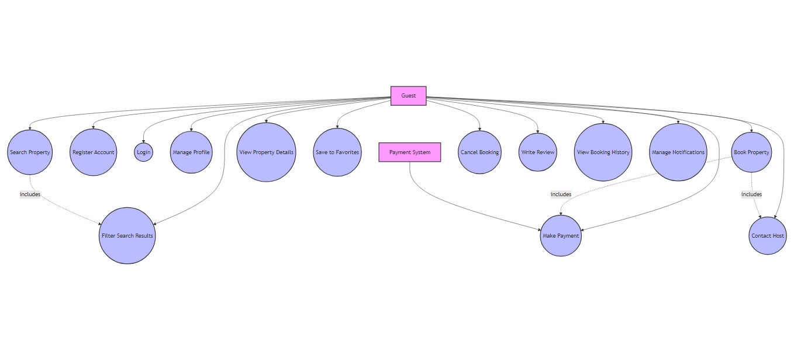

# Requirement Analysis in Software Development

## Introduction
This repository is dedicated to understanding and documenting the Requirement Analysis phase in the Software Development Lifecycle (SDLC). It serves as a comprehensive guide for defining, gathering, and analyzing requirements, laying a solid foundation for successful project execution.

## Why is Requirement Analysis Important?

Requirement Analysis is a crucial phase in the Software Development Lifecycle (SDLC) for the following reasons:

1. **Clarity and Understanding**  
   It ensures that stakeholders and the development team have a clear, mutual understanding of the project’s objectives and requirements, reducing ambiguity and potential miscommunication.

2. **Scope Definition**  
   Clearly defining the project scope prevents scope creep, ensuring that the project stays focused and aligned with the agreed objectives.

3. **Foundation for Design and Development**  
   It provides a solid base for designing and developing the system, aligning all technical and functional aspects with stakeholder expectations, ultimately saving time and resources.

   ## Key Activities in Requirement Analysis

Requirement Analysis involves a series of key activities to ensure that the software system meets the expectations and needs of stakeholders. These activities include:

- **Requirement Gathering**  
  Collecting detailed information from stakeholders using techniques such as:  
  - Interviews  
  - Surveys/Questionnaires  
  - Workshops  
  - Observations  
  - Document Analysis  

- **Requirement Elicitation**  
  Refining and elaborating on gathered requirements through:  
  - Brainstorming sessions  
  - Focus group discussions  
  - Prototyping to visualize and refine system requirements  

- **Requirement Documentation**  
  Structuring and recording requirements for clarity and reference, including:  
  - Requirement Specification Documents  
  - User Stories describing functionality from a user’s perspective  
  - Use Case Diagrams showing interactions between users and the system  

- **Requirement Analysis and Modeling**  
  Analyzing and organizing requirements with activities like:  
  - Prioritizing based on importance and impact  
  - Conducting feasibility analysis for technical and financial constraints  
  - Creating visual models such as data flow diagrams and entity-relationship diagrams  

- **Requirement Validation**  
  Ensuring requirements are accurate, complete, and feasible by:  
  - Reviewing requirements with stakeholders  
  - Defining clear acceptance criteria for each requirement  
  - Establishing traceability to track requirements throughout development  
## Key Activities in Requirement Analysis

Requirement Analysis involves a series of key activities to ensure that the software system meets the expectations and needs of stakeholders. These activities include:

- **Requirement Gathering**  
  Collecting detailed information from stakeholders using techniques such as:  
  - Interviews  
  - Surveys/Questionnaires  
  - Workshops  
  - Observations  
  - Document Analysis  

- **Requirement Elicitation**  
  Refining and elaborating on gathered requirements through:  
  - Brainstorming sessions  
  - Focus group discussions  
  - Prototyping to visualize and refine system requirements  

- **Requirement Documentation**  
  Structuring and recording requirements for clarity and reference, including:  
  - Requirement Specification Documents  
  - User Stories describing functionality from a user’s perspective  
  - Use Case Diagrams showing interactions between users and the system  

- **Requirement Analysis and Modeling**  
  Analyzing and organizing requirements with activities like:  
  - Prioritizing based on importance and impact  
  - Conducting feasibility analysis for technical and financial constraints  
  - Creating visual models such as data flow diagrams and entity-relationship diagrams  

- **Requirement Validation**  
  Ensuring requirements are accurate, complete, and feasible by:  
  - Reviewing requirements with stakeholders  
  - Defining clear acceptance criteria for each requirement  
  - Establishing traceability to track requirements throughout development
 
## Types of Requirements

In software development, requirements are categorized into Functional and Non-functional Requirements. Here’s a breakdown for the booking management system:

### Functional Requirements ⚙️

Functional requirements define what the system should do, focusing on specific functionalities and features. For the booking management system, examples include:

- **Search Properties**:  
  Users should be able to search for properties based on location, price, and availability.

- **User Registration**:  
  New users should be able to create accounts by providing personal details and login credentials.

- **Property Listings**:  
  Display properties with essential details such as images, descriptions, and pricing.

- **Booking System**:  
  Users should be able to book properties, view booking details, and manage their reservations.

- **User Authentication**:  
  Secure login and registration process to protect user data and ensure only authorized access.

### Non-functional Requirements 🛡️

Non-functional requirements describe how the system should perform, focusing on quality attributes like performance, security, and usability. For the booking management system, examples include:

- **Performance**:  
  The system should load pages within 2 seconds and handle up to 1000 concurrent users.

- **Security**:  
  Implement data encryption for sensitive information and ensure protection against vulnerabilities like SQL injection and cross-site scripting.

- **Scalability**:  
  The system should scale horizontally to accommodate increased traffic during peak periods.

- **Usability**:  
  The application should feature an intuitive and user-friendly interface, making it easy for users to navigate and perform tasks.

- **Reliability**:  
  Ensure 99.9% uptime with mechanisms for quick recovery in case of system failures.

  ## Use Case Diagrams 📊

### What are Use Case Diagrams?

Use Case Diagrams visually represent the interactions between users (actors) and the system. They provide a high-level overview of the system’s functionalities and help identify the roles of different users.

### Benefits of Use Case Diagrams
- **Clarity**: Simplify understanding of system functionalities.
- **Organization**: Identify and organize system requirements efficiently.
- **Communication**: Serve as a common reference for stakeholders and the development team.

### Use Case Diagram for the Booking System

Below is the use case diagram for the booking management system:

